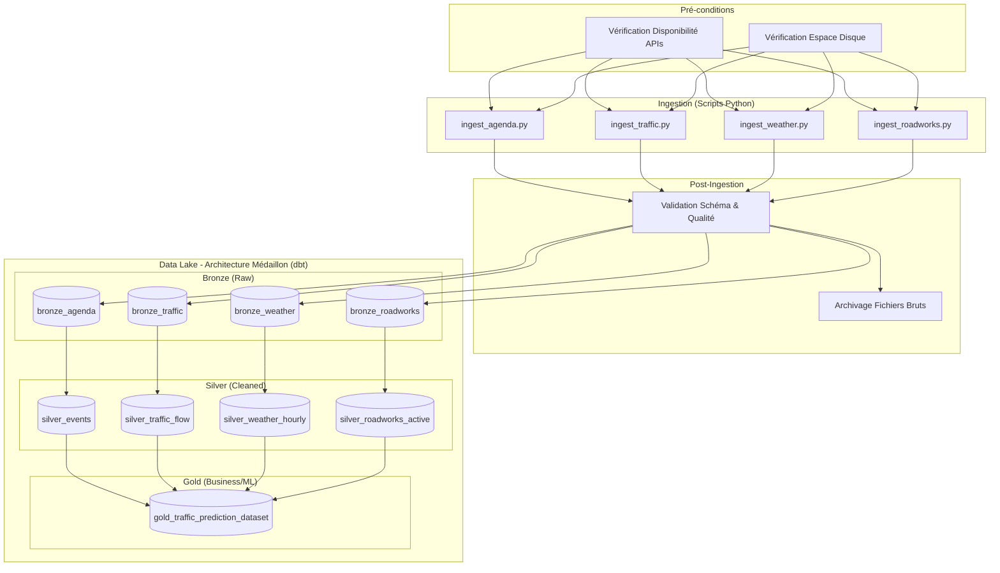

# Atelier 3 - Architecture du Pipeline de Données (Bordeaux Tourisme)

Ce document décrit l'orchestration du pipeline de données pour le projet de prédiction de trafic à Bordeaux, suivant une architecture en médaillon et orchestré par un DAG.

## 1. Vue d'ensemble du DAG (Directed Acyclic Graph)

Le pipeline intègre les scripts existants ainsi que les nouveaux scripts d'ingestion nécessaires pour les facteurs prédictifs identifiés (Trafic, Météo, Travaux).

### Diagramme du Pipeline (Mermaid)

## 2. Détail des Composants

### A. Scripts d'Ingestion
Ces scripts collectent les données brutes et les déposent dans le Data Lake (format Parquet/JSON).

1.  **`ingest_agenda.py`** (Existant)
    *   *Source* : OpenAgenda / Open Data Ville de Bordeaux.
    *   *Rôle* : Récupère les événements culturels et sportifs.
2.  **`ingest_traffic.py`** (Nouveau - Priorité 1)
    *   *Source* : API Bordeaux Métropole (Temps réel) / Bison Futé.
    *   *Rôle* : Collecte les débits, vitesses moyennes et taux de congestion.
3.  **`ingest_weather.py`** (Nouveau - Priorité 2)
    *   *Source* : Météo France (Données publiques).
    *   *Rôle* : Récupère température, précipitations, vent.
4.  **`ingest_roadworks.py`** (Nouveau - Priorité 3)
    *   *Source* : Open Data Bordeaux Métropole.
    *   *Rôle* : Liste les chantiers et fermetures de voies en cours.

### B. Opérations Auxiliaires

*   **Vérification des préconditions** :
    *   S'assurer que les endpoints API répondent (HTTP 200) avant de lancer les jobs d'ingestion pour éviter les échecs silencieux ou partiels.
*   **Contrôle (Monitoring)** :
    *   Logging centralisé de l'exécution des scripts.
    *   Alerting en cas de volume de données anormalement bas (ex: fichier vide).
*   **Traitement des résultats** :
    *   Validation de la structure des fichiers (présence des colonnes clés).
    *   Déplacement des fichiers traités vers un dossier d'archive (`/archive`) pour garder le dossier d'ingestion (`/landing`) propre.

### C. Modèles dbt (Architecture Médaillon)

#### Zone Bronze (Raw)
*Représentation directe des données sources, sans modification de valeur.*
*   `bronze_agenda` : Données brutes des événements.
*   `bronze_traffic` : Logs bruts de trafic.
*   `bronze_weather` : Relevés météo bruts.
*   `bronze_roadworks` : Liste brute des travaux.

#### Zone Silver (Cleaned & Enriched)
*Données nettoyées, typées et standardisées.*
*   **`silver_events`** :
    *   *Opérations* : Parsing des dates, filtrage sur la zone géographique (Bordeaux centre vs périphérie), dédoublonnage des événements.
    *   *Enrichissement* : Ajout de catégories d'impact (Fort/Moyen/Faible) via `enrich_agenda.py` (logique intégrée ou script appelé via dbt python models).
*   **`silver_traffic_flow`** :
    *   *Opérations* : Gestion des valeurs manquantes (imputation ou exclusion), conversion des timestamps en UTC, harmonisation des identifiants de tronçons routiers.
*   **`silver_weather_hourly`** :
    *   *Opérations* : Interpolation pour garantir une donnée par heure, conversion des unités si nécessaire.
*   **`silver_roadworks_active`** :
    *   *Opérations* : Filtrage pour ne garder que les travaux actifs à la date d'analyse, normalisation des coordonnées GPS.

#### Zone Gold (Business / ML Ready)
*Données agrégées prêtes pour la consommation.*
*   **`gold_traffic_prediction_dataset`** :
    *   *Opérations* : Jointure de toutes les tables Silver sur la dimension Temps (Heure) et Espace (Quartier/Segment).
    *   *Structure* : Une ligne par heure et par segment routier avec les colonnes : `traffic_flow`, `weather_condition`, `is_holiday`, `active_roadworks_count`, `major_events_count`.
    *   *Usage* : Entraînement du modèle prédictif.
